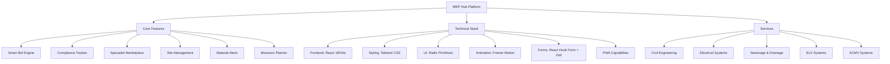

# MEP Hub for Malaysian Contractors

[](https://reactjs.org/)
[](https://vitejs.dev/)
[](https://tailwindcss.com/)
[](https://www.typescriptlang.org/)
[](https://opensource.org/licenses/MIT)
[](CONTRIBUTING.md)
[](https://web.dev/progressive-web-apps/)
[](https://nodejs.org/)

## 📋 Table of Contents

- [Overview](#-overview)
- [UI Preview](#-ui-preview)
- [Architecture](#-architecture)
- [Core Features](#-core-features)
- [Technical Stack](#-technical-stack)
- [Quick Start](#-quick-start)
- [Project Structure](#-project-structure)
- [Services Offered](#-services-offered)
- [Contributing](#-contributing)
- [License](#-license)
- [Contact](#-contact)

## 📖 Overview

A modern web application designed specifically for Malaysian Civil and MEP (Mechanical, Electrical, and Plumbing) contractors to streamline project management, ensure regulatory compliance, and connect with specialized professionals.

## 🎨 UI Preview
  
### Dashboard View


### Mobile Interface


---

# Architecture



## ✨ Core Features

- **Smart Bid Engine**: Generate accurate project bids using Malaysia-specific cost databases
- **Compliance Tracker**: Automated monitoring of CIDB regulations and local building codes
- **Specialist Marketplace**: Connect with verified MEP professionals across Malaysia
- **Site Management Tools**: Real-time project tracking and team updates
- **Material Price Alerts**: Instant notifications for cost fluctuations and availability
- **Monsoon Risk Planner**: Schedule optimization based on historical weather data
- **PWA Offline Support**: Full functionality without internet connection
- **Dark/Light Mode**: Adaptive interface for different working environments

## 🛠️ Technical Stack

| Layer | Technology |
|-------|------------|
| **Frontend Framework** | React 18 + Vite 5 |
| **Styling** | Tailwind CSS 3 |
| **UI Components** | Radix UI Primitives |
| **Animations** | Framer Motion 10 |
| **Forms** | React Hook Form with Zod validation |
| **Routing** | React Router 6 |
| **State Management** | React Context API + Custom Hooks |
| **PWA** | Service Workers for offline functionality |
| **Icons** | Lucide React |
| **Testing** | Jest + React Testing Library |

## 🚀 Quick Start

### Prerequisites
- Node.js (v20 or higher)
- npm (v9 or higher)

### Installation
```bash
# Clone the repository
git clone https://github.com/MatMoto-Admin/MEP.git
cd MEP

# Install dependencies
npm ci

# Start development server
npm run dev
```

Navigate to `http://localhost:5173` to view the application.

### Production Build
```bash
# Create production build
npm run build

# Or use the build script
./build.sh
```

### Testing
```bash
# Run test suite
npm test

# Run tests with coverage
npm test -- --coverage
```

## 📁 Project Structure

```
MEP/
├── .github/                   # GitHub workflows and CI/CD configuration
├── backend/                   # Mock API services and endpoints
├── Documentation/             # Comprehensive project documentation
├── public/                    # Static assets and PWA files
│   ├── manifest.json          # PWA configuration
│   ├── sw.js                  # Service worker implementation
│   └── icons/                 # App icons for various devices
├── src/
│   ├── assets/                # Images, fonts, and static resources
│   ├── components/            # Reusable React components
│   │   ├── ui/                # Fundamental UI components (Button, Card, etc.)
│   │   ├── layout/            # Layout components (Header, Sidebar, etc.)
│   │   ├── forms/             # Form components and validation
│   │   └── features/          # Feature-specific components
│   ├── hooks/                 # Custom React hooks
│   ├── lib/                   # Utilities and helper functions
│   ├── pages/                 # Page-level components
│   ├── styles/                # Global styles and Tailwind config
│   ├── types/                 # TypeScript type definitions
│   ├── App.jsx                # Root application component
│   └── main.jsx               # Application entry point
├── tests/                     # Test suites and testing utilities
├── scripts/                   # Build and deployment scripts
├── keys/                      # SSL keys and security configurations
├── mobile/                    # Mobile-specific configurations
└── Configuration files (vite.config.js, tailwind.config.js, etc.)
```

## 🔧 Services Offered

The platform supports comprehensive MEP contracting services:

- **Civil Engineering**: Structural design and construction management
- **Electrical Systems**: Power distribution and safety solutions
- **Sewerage & Drainage**: Stormwater management and flood mitigation
- **ELV Systems**: Communication and building automation
- **ACMV Systems**: Air conditioning and mechanical ventilation

## 🌐 Browser Support

- Chrome (latest 2 versions)
- Firefox (latest 2 versions)
- Safari (latest 2 versions)
- Edge (latest 2 versions)
- Mobile browsers (iOS Safari, Chrome for Android)

## 🤝 Contributing

We welcome contributions! Please follow these steps:

1. Fork the repository
2. Create a feature branch (`git checkout -b feature/amazing-feature`)
3. Commit your changes (`git commit -m 'Add some amazing feature'`)
4. Push to the branch (`git push origin feature/amazing-feature`)
5. Open a Pull Request

For major changes, please open an issue first to discuss what you would like to change.

## 📄 License

This project is licensed under the MIT License - see the [LICENSE](LICENSE) file for details.

## 📞 Contact

For questions or support, please contact us at **info@mep.pro**

---

*Designed specifically for the Malaysian construction industry*
